# Team Information

Sharanya R [PES1UG24CS902]

Ramya H R [PES1UG25CS835]

# Build, Load, and Run Instructions

- Install build tools
```
sudo apt update
sudo apt install -y build-essential linux-headers-$(uname -r) wget git
```
- Clone the repository
```
git clone https://github.com/SharGIT-prog/OS-Jackfruit.git
```
- Build all the targets
```
cd /OS-Jackfruit/boilerplate
make
```
- Verify the existance of binaries
```
ls -lh engine cpu_hog io_pulse memory_hog monitor.ko
```
- Run the preflight script
```
chmod +x environment-check.sh
sudo ./environment-check.sh
```
- Prepare Root Filesystems
```
mkdir rootfs-base
wget https://dl-cdn.alpinelinux.org/alpine/v3.20/releases/x86_64/alpine-minirootfs-3.20.3-x86_64.tar.gz
tar -xzf alpine-minirootfs-3.20.3-x86_64.tar.gz -C rootfs-base
```
- Create per-container writable rootfs copies
```
cp -a ./rootfs-base ./rootfs-alpha
cp -a ./rootfs-base ./rootfs-beta
```
- Copy workload binaries into each rootfs
```
cp cpu_hog ./rootfs-alpha/
cp io_pulse ./rootfs-alpha/
cp memory_hog ./rootfs-alpha/
cp cpu_hog ./rootfs-beta/
cp io_pulse ./rootfs-beta/
cp memory_hog ./rootfs-beta/
```
- Insert the kernel module
```
sudo insmod monitor.ko
```
- Verify that the module loaded (check the init message)
```
ls -l /dev/container_monitor
```
- Start the supervisor (This is the long running process, keep it running forever)
```
sudo ./engine supervisor ./rootfs-base
```
- Start the container (Open a new terminal to run the cli commands)
```
sudo ./engine start alpha ./rootfs-alpha /cpu_hog 90 --soft-mib 48 --hard-mib 80
sudo ./engine start beta ./rootfs-beta /cpu_hog 90 --soft-mib 64 --hard-mib 96
```
- Run the commands to observe how the CLI works
```
sudo ./engine run mountcheck ./rootfs-alpha /bin/sh -c "mount | grep proc"
sudo ./engine ps   # List tracked containers
sudo ./engine logs alpha # Inspect one container
sudo ./engine stop alpha # Stop containers
```
- Inspect the Bounded Buffer logging
```
sudo ./engine logs alpha
# Also inspect the supervisor terminal to understand the producer consumer interaction
```
- Run memory test inside a container
```
cp -a ./rootfs-base ./rootfs-mem && cp memory_hog ./rootfs-mem/
sudo ./engine start memtest ./rootfs-mem /memory_hog 8 500 --soft-mib 16 --hard-mib 32
sleep 6
sudo ./engine ps | grep memtest
sudo dmesg -w | grep container_monitor    # Run in a new terminal
```
- Run scheduling experiment workloads
```
cp -a ./rootfs-base ./rootfs-hog15 && cp cpu_hog ./rootfs-hog15/
sudo ./engine start hog0  ./rootfs-alpha  /cpu_hog 30
sudo ./engine start hog15 ./rootfs-hog15 /cpu_hog 30 --nice 15
wc -l logs/hog0.log logs/hog15.log
```
- Cleanup commands
```
sudo ./engine stop beta #Stop any container which is running
```
Press Ctrl+C in the supervisor terminal
```
ps aux | grep defunct                            # Verify that no zombie processes exist
sudo dmesg | tail -20                            # Inspect final kernel log
sudo rmmod monitor                               # Unload the kernel module
ls /tmp/mini_runtime.sock                        # Verify that the socket file is cleaned up
```


# Demo with Screenshots

1. Multi-container supervision

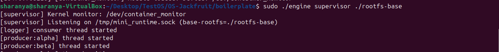

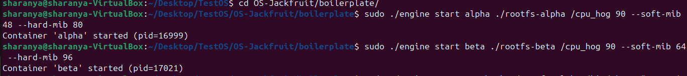

Two containers (alpha, beta) are running concurrently under one supervisor. Supervisor
[Terminal 1] shows that producer threads have started for each container. [Terminal 2]
shows that start commands have returned with host PIDs.

2. Metadata tracking

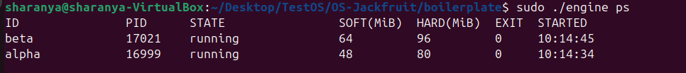

engine ps output shows both containers being tracked with host PID, state=running,

configured memory limits (soft/hard in MiB), exit code 0, and start time.

3. Bounded-buffer logging

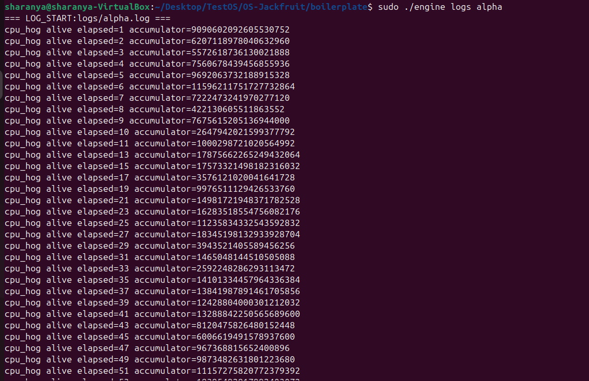

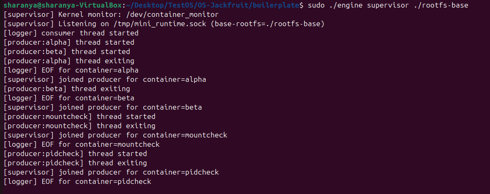

engine logs alpha displays the output of cpu_hog collected through the

bounded-buffer pipeline. Supervisor [Terminal 1] shows the producer thread reading
from pipe and logger consumer writing to file. The lines are cpu_hog's stdout printed
once a second.


4. CLI and IPC


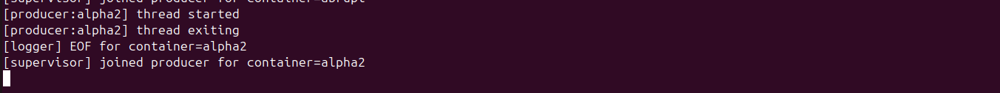

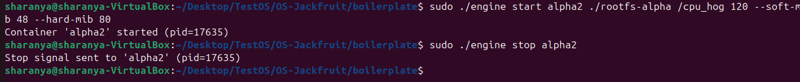

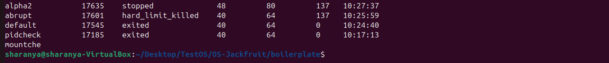

engine stop alpha sends CMD_STOP over the UNIX domain socket, and the supervisor
sets stop_requested=1 then sends SIGTERM. ps confirms state=stopped. (alpha shows
stopped, not killed, because stop_requested was set before the signal). Producer
thread is joined cleanly in T1.

5. Soft-limit warning

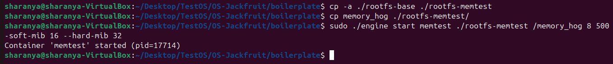

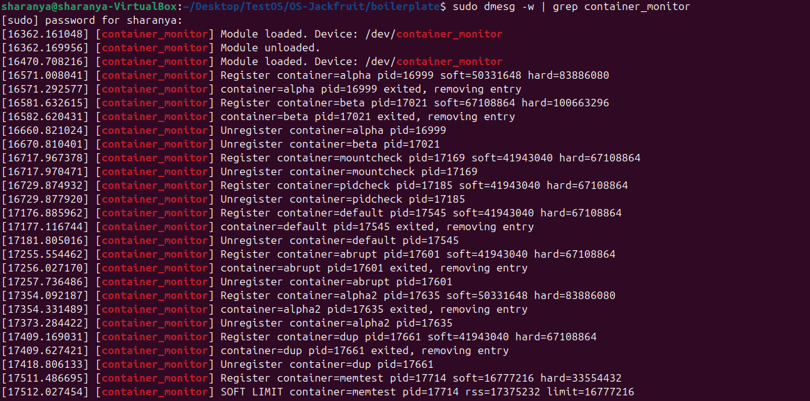

dmesg shows SOFT LIMIT event from kernel module for the container=memtest. RSS (in
bytes) has exceeded the 16 MiB soft limit. This is a one-time warning logged via
printk(KERN_WARNING), and the soft_warned flag is set to 1 after this.

6. Hard-limit enforcement

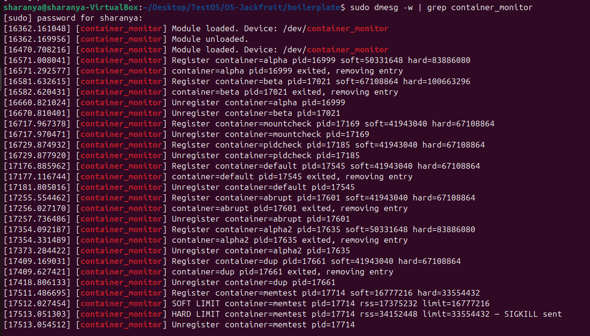

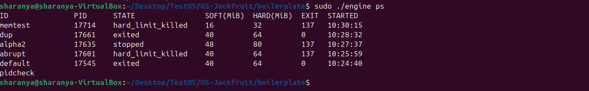

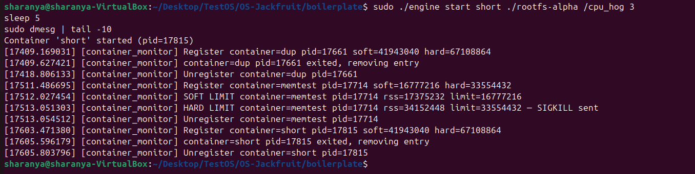

Hard-limit enforcement: the kernel module had sent SIGKILL when memtest RSS
exceeded 32 MiB. dmesg [Terminal 3] shows the HARD LIMIT event. engine ps [Terminal
2] shows the state=hard_limit_killed (distinct from stopped), and hence proves the use
of stop_requested=0 path.

7. Scheduling experiment

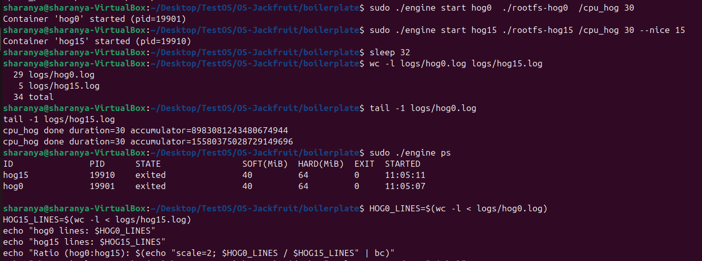

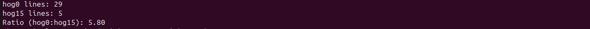

hog0 (nice=0) logged 29 lines vs hog15 (nice=+15) logged 5 lines over the same 30-
second wall-clock period. Ratio ≈ 5.8 :1.

Both say duration=30 because cpu_hog counts wall-clock seconds. But hog0 logged

29 "alive" lines (one per second of wall time it was actually running) while hog

logged only 5 because it received far less CPU time per wall-clock second.

8. Clean teardown

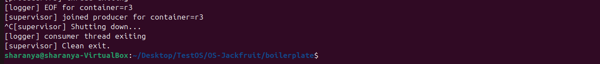

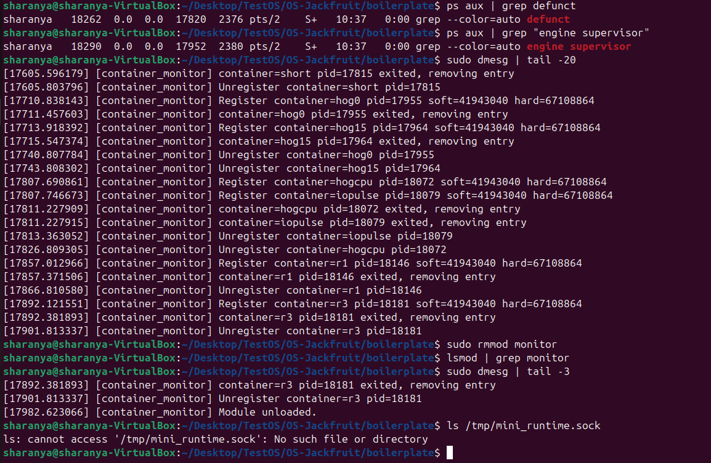


Supervisor [Terminal 1] logs joined producer threads and clean exit. No zombie
processes are recorded [Terminal 2 top]. dmesg confirms that the module has unloaded
[Terminal 2 middle]. Socket file has also been removed [T2 bottom]. All heap, FDs, and
kernel list entries have been freed.

# Engineering Analysis

Address these five areas:

**1. Isolation Mechanisms**

   - Using namespaces and chroot, the containers are isolated. Each container
    views itself as an isolated system with no other containers in the system, but the
    host can interact with all the various containers. The runtime calls clone() with
    three namespace flags. There are three mechanisms-

   - PID Namespace – The host views the real PID of the process (Eg: 12619), whereas
the containers themselves view the processes as primary and initial having PID =
1,2, so on. So the cloned process becomes PID 1 in its namespace. The other
children of the supervisor are invisible to it.

* The kernel maintains a separate PID counter per namespace.
* The first process inside the namespace gets PID 1, regardless of its host PID.
* inside the container shows only processes within the namespace
* If PID 1 (the container's init) exits, the kernel sends SIGKILL to all other
    processes in that namespace. This happens in order to prevent containers
    from being orphaned.
  - UTS Namespace – The hostname and domain name of the container. The host
reads ubuntu-vm, whereas the container reads it as its id (eg: alpha). Each container
gets a unique hostname.
* This ensures that the sethostname function only affects the child’s UTS
namespace and not the host’s hostname.
* Thus, running hostname inside a container returns the container ID, not the
VM hostname.
  - Mount Namespace – The host has its file system unaffected, whereas each
container perceives its roots to be the main root. Each container has its own mount
table.
* After cloning, mount operations inside the child affect only the child's view of
the filesystem.
* When the mount function is called by the child, it installs a new /proc which
only shows the container’s PID namespace process.
* This prevents the mounts from affecting the host or other containers, and
helps enable rootfs isolation.

Chroot

- chroot(path) sets task->fs->root to the directory inode of path.
- All subsequent VFS path lookups start from this root, the processes cannot reach
the main parent directory from the new root.
- Each container sees only within its assigned rootfs-* directory, and / inside
container points to the container's rootfs.
- The host filesystem remains inaccessible
- Chdir is used to reset the working directory.

Shared resources

- Hardware (CPU, RAM, Storage)
- Kernel
- Filesystems and Inode cache
- Clock
- Network Stack
- UID, GID

**2. Supervisor and Process Lifecycle**

- The CLI interface works based on request-response mechanism, so it needs a long
running supervisor which constantly listens to requests and services them. It also
has to handle multiple simultaneous clients, and store the metadata for all the
containers.
- If there is no long running process, then when a child process finishes, there will not
be any main process to track the SIGCHILD output, and details of the child process
to reallocate the resources, which will lead to the formation of orphan processes.
These orphan processes get reparented to PID 1, and their metadata cannot be
tracked.
- To save the logs or ps data, a long running process is required, otherwise the
metadata will be removed when the supervisor process terminates.
- The log pipeline, the bounded buffer and logger thread should work for any
container, so they cannot exit before the child.
Since the supervisor is the parent of all the containers, it receives SIGCHLD upon
the exit of every container, as the containers are created from the supervisor via
clone(). It maintains the linked list of the metadata of containers. It also owns the
logging pipe mechanism. And it holds the kernel module fd open for the lifetime of
all containers.


Process Creation

- The supervisor runs clone() with namespace flags. This creates a child in a
    new namespace.
- The child shares the parent's address space in copy-on-write mode initially,
    then execv() replaces the image entirely.
  
Parent-child relationships

- The host PID of the container is known to the supervisor, since it is a return
value of clone().
- The supervisor stores it in rec->host_pid.
  
Reaping

- signal(SIGCHLD, SIG_IGN) enables automatic reaping
- waitpid(-1, &status, WNOHANG) in sigchld_handler reaps all exited children
    immediately.
- The WNOHANG flag prevents blocking, so the signal handler runs
    asynchronously and does not stall.
- The signals are not queued, so when multiple children exit between signal
    deliveries, the children are picked arbitarirly (-1 argument)
- The SIGCHILD sends the information of the exited child back to the
    supervisor.

Metadata Tracking

- Container ID, Host PID, State, Memory Limits, Log file path, start time are the
    metadata of the child maintained by the parent.
- The metadata (struct container_record_t ) of the children is maintained by the
    supervisor as a linked list.
- rec->state maintains the transitioning states (Started, running, exited,
    stopped, killed, hard_limit_killed)
- stop_requested flag is set in order to differentiate between a requested stop
    and a hard-limit kill.

Signal Delivery

- SIGCHLD is delivered to the supervisor's main thread, as it is the only thread
    which runs the accept loop.
- SA_RESTART causes interrupted syscalls to restart automatically
- The handler itself is async-signal-safe - it only calls waitpid(),
    pthread_mutex_lock(), and basic comparisons
- SIGCHLD is handled implicitely using the SIG_IGN flag, which is
    automatically reaped by the kernel.
- SIGINT/SIGTERM signals set the shutdown flag in order to print the right
    status.
  
**3. IPC, Threads, and Synchronization**
IPC Mechanisms
- Logging Pipe:

  o This is a unidirectional anonymous pipe which is used to pass the
  logging messages from the container to the supervisor.
  
  o Each container's stdout and stderr are redirected to the write end of
  the pipe.
  
  o The producer thread reads from the logging pipe, and pushes the data
  to the bounded buffer. The consumer reads from the bounded buffer
  and writes the data onto the logging files.
  
  o The pipe is created before clone(), so both ends exist in the parent's
  address space, hence enabling communication between the parent
  and child.

- UNIX Socket:
  
    o This is a bidirectional, indirect message passing mechanism.
  
    o This exists between the CLI processes and the supervisor.
  
    o The supervisor listens on the socket and accepts the requests from
       the CLI processes, and sends the response back through the socket.
  
- Bounded Buffer

Shared resources

The cfg flag is shared by the parent and child. If the parent frees it first, then the child
will read garbage values when it reads the cfg. To prevent this, a ready pipe is used.

- When the parent clones, it reads the readypipe and blocks the cfg variable.
- The child can then create a local copy of the cfg and writes to the readypipe,
    after which the parent unblocks and frees the cfg.

ctx->containers is constantly accessed by multiple functions, and any two
accessing it at once will cause a race condition.
- It is accessed to check for the uniqueness of a container, add a container,
and to retrieve the metadata of the container (ps command)
- It is accessed by SIGCHILD when a container exits
- The logging function also accesses it.
To protect the linked list, the mutex metadata_lock is used. It ensures only
one thread modifies the buffer at a time. While one thread is accessing a
resource, it locks the mutex lock, and the other thread sleeps until the thread
holding the resource unlocks the mutex lock and the thread is woken.

The fields of the struct container_record_t are also protected by the metadata_lock
mutex. Without this, the main thread of the supervisor reads state for when the
CMD_RUN polls, but at the same time the signal handler writes to it, resulting in a
race condition.

The bounded buffer (log_buffer) can be

- Accessed by two producers simultaneously to write on it on the same slot,
    causing the data to be overwritten
- The count variable can be accessed by the producer and consumer
    simultaneously
- The bounded buffer variables (head, tail, count, shutting_down) are protected by
the buf->mutex. The mutex makes the entire push or pop operation appear
atomic to other threads. Only one thread touches count, head, tail at a time, thus
ensuring that no torn reads and overwritten updates exist.

log_buffer is accessed by both the consumer and producer, so there is a conflict
which arises when the buffer is either full or empty. Consumer spin-waits when the
buffer is empty, thus wasting the CPU resources. The producer waits when the
buffer is full.

- This is handled by the condition variables - not_empty and not_full.
- These variables allow the threads to sleep efficiently without busy-waiting.

buf->shutting_down flag is also a shared resource. If the consumer reads the
shutting_down flag as 0, after which the main thread sets it as 1 and broadcasts the
signal, then the consumer misses the broadcast and sleeps forever.
- This is prevented by the buf->mutex. The consumer locks the mutex when
reading the shutting_down as 0, and then waits, where the lock is atomically
released, and the thread goes to sleep.
- The main thread then locks the mutex, sets the shutting_down as 1, and
broadcasts the signal, and unlocks the mutex.
- When the consumer reaquires the lock, in rightly receives the broadcast, and
exits properly.

**4. Memory Management and Enforcement**

RSS counts the number of physical RAM pages currently mapped and present in a
process's page table. It finds the sum of –

- MM_FILEPAGES: pages mapped from files (executable code, shared libraries,
    mmap files)
- MM_ANONPAGES: anonymous pages (heap, stack, mmap-anonymous)
- MM_SHMEMPAGES: shared memory pages

It does not measure:
- Swapped pages
- Memory-mapped but not yet touched pages
- Shared libraries (counted once for each process, so sum is inflated)
- Page cache (not directly attributed to any process)
- Kernel memory (buffers, slab, page tables)

The soft limit is a warning threshold. It signals by logging a warning(printk to dmesg)
once per container lifetime that a process is using more memory than expected, but
does not immediately terminate it. This is useful for:
  - Detecting memory leaks early (log a warning and investigate)
  - Alerting operators without disrupting running work
  - Providing headroom for bursty workloads


The hard limit is an enforcement threshold. Exceeding it means the process is actively
endangering system stability. It prevents memory exhaustion from crashing the host and
guarantees resource isolation. SIGKILL is sent unconditionally upon reaching hard limit.

Kernel Space

Reliability

- A userspace monitor thread using sleep(1) can be delayed by the scheduler,
    preempted, or starved (especially if the process being monitored is hogging
    CPU).
- The kernel timer fires via the hardware timer interrupt, independent of
    process scheduling.
- User-space process could crash or be starved, whereas kernel monitor runs
    with high priority and cannot be preempted indefinitely. Therefore, it enforces
    limits regardless of supervisor state.

Access to mm internals

- get_mm_rss(mm) reads mm->rss_stat - a kernel-internal data structure.
Userspace can approximate RSS via /proc/[pid]/status or /proc/[pid]/statm,
but this requires opening and parsing files for each container on every check,
which is expensive and can lead to race conditions.
- User-space code also runs periodically, not continuously. When the
Administrator checks RSS, starts kill sequence. However, before the kill can
complete, the process allocates more memory.
- The kernel module accesses the counters directly, and reacts immediately.

Atomic signal delivery
- send_sig(SIGKILL, task, 1) from kernel space delivers the signal
unconditionally, bypassing the target process's signal mask and handling.
- A userspace kill(pid, SIGKILL) requires the supervisor to be notified first via
IPC, thus adding latency
- Kernel can enforce limit before the memory is committed, and it can also
prevent page fault allocation via memory policies

Efficiency
- User-space polling requires constant scheduler interaction, and it has to
track the state with its own synchronization.
- Kernel does not require any context switch for monitoring, and because the
    timer callback runs in softirq context, task scheduling overhead does not
    exist.
  
**5. Scheduling Behavior**

| Container | Nice Value | Log Lines | CPU Share |
|----------|-----------|----------|----------|
| hog0     | 0         | 29       | 85%      |
| hog15    | 15        | 5        | 14%      |

- For CPU-bound workloads with different priorities, high-priority tasks (with lower
nice values: -20) receive more CPU slices, thus are more responsive, whereas low-
priority tasks (with nice : +19) receive lesser CPU slices, hence produce lower
throughput
- This priority scheduling is more beneficial to I/O bound tasks, as they can wake
immediately after I/O
- io_pulse gets completed in ~5-6 seconds despite cpuburn running at full tilt. This
demonstrates scheduler responsiveness for I/O-bound processes.
- Fairness - nice=15 intentionally sacrifices throughput for the benefit of higher-
priority work. But tasks with same priority (nice=0) get equal time over long intervals,
and share the CPU equally.
- Responsiveness – the io_pulse completes on schedule despite the CPU pressure.
The tasks woken from I/O get an interactive priority boost.
- Throughput - hog0 completes its 30-second workload in exactly 30 wall-clock
seconds (it gets 85% of CPU, and runs 15% slower than if it was the only running
process, yet it completes successfully). High-priority tasks complete faster,
reducing system latency

# Design Decisions and Tradeoffs

- For namespace isolation, chroot over pivot_root, because it is simple, it
    works with only one syscall, and it does not have a requirement for the new
    root to be on a separate mount point. But in chroot privileged process inside
    the container can escape, whereas pivot_root provides stronger guarantees
    by changing task->fs->pwd and preventing the old root from being accessible
    at all.


- For supervisor architecture, a centralized supervisor process managing child
    records was chosen over a decentralized model where children manage
    themselves, because it allows for centralized logging and state tracking via a
    metadata lock. But a centralized supervisor is a single point of failure; if it
    crashes, all container management is lost. This was the right call because it
    enables reliable SIGCHLD handling and provides a unified interface for the
    CLI to query container status.
- For IPC and logging, UNIX domain sockets and anonymous pipes were
    chosen over shared memory and FIFOs, because sockets offer reliable
    bidirectional communication for control requests and pipes naturally handle
    EOF when a container exits. But shared memory is faster for high-throughput
    data transfer. Sockets and pipes were the right choice here as they provide
    built-in synchronization and simplify the producer-consumer logic for the
    logging thread.
- For kernel monitoring, a character device with a periodic timer callback was
    chosen over a purely user-space solution or a procfs-based crawler, because
    it allows direct, privileged access to Resident Set Size (RSS) and task
    structures without the overhead of repeated filesystem parsing. But a kernel
    module increases the risk of a system-wide crash if a bug occurs in the
    monitor code. This was justified because it ensures the hard-limit
    enforcement (SIGKILL) is immediate and tamper-proof from within the
    container.
- For scheduling experiments, CPU affinity (pinning to Core 0) and cgroup
    weights were chosen over simple nice values, because pinning forces
    contention on a single core, ensuring that the CFS scheduler enforces the
    weight ratios accurately. But pinning to a single core prevents the container
    from utilizing available multi-core parallelization. This was the right call for an
    experiment, as it produces deterministic, measurable CPU share ratios that
    would otherwise be obscured by the kernel balancing processes across
    multiple idle cores.
- For the IPC communication between the CLI process and the supervisor,
    UNIX socket was chosen over FIFO and shared memory because it provides
    bidirectional, connection-oriented, reliable communication. But shared
    memory is faster.
- For logging container output anonymous pipes were chosen over socket and
    FIFO, because it can be naturally inherited across clone(), and the write end
    closes automatically on child death, giving clean EOF. But sockets are more
    flexible, and are better for multiplexing many connections. FIFOs work on
    unrelated processes as well, and exist in filesystems for easier debugging.
- Mutex are used to protect the bounded buffer over spinblocks. A spinlock
    held across blocking syscalls would cause the kernel scheduler to context-
    switch away while the lock is held, forcing other waiters to spin-waste CPU. A
    mutex releases the CPU (futex wait) while blocked. But a spinlock can
    prevent a context switch, and also avoids futex syscall overhead when
    contention is low.

- Condition Variables are preferred over semaphores, as when
    shutting_down=1, all blocked threads need to be woken(multiple producers
    and the consumer). A semaphore only increments by 1, waking one thread.
    Thus for a broadcase n semaphores will be needed. However, semaphores
    are simpler for producer-consumer counting problems, and don’t need
    external predicates
- Ready pipe is used for cfg synchronization over memory barrier or usleep
    because it is deterministic and ensures that the child signals exactly when it's
    done, whereas usleep is static and could fail under load. But memory barriers
    are much faster, and fully avoid kernel involvement. Usleep is very simple.

# Scheduler Experiment Results

| Container ID | Nice Value | Log Lines Generated | CPU Weight (v2) | Calculated CPU Ratio |
|--------------|-----------|---------------------|------------------|----------------------|
| hog0         | 0         | 29                  | 100              | 85%                  |
| hog15        | 15        | 5                   | 11               | 14%                  |
| **Total**    |           | 34                  | 111              | 100%                 |

- The results demonstrate that the Linux Completely Fair Scheduler (CFS)
    accurately enforces proportional CPU distribution based on cgroup weights.
    With a measured line count of 29 for hog0 and 5 for hog15, the experimental
    ratio is 5.8:1, which demonstrates the intended bias, although it deviates
    from the theoretical 9.1 ratio due to the short 30-second sampling window,
    variation in CPU and hardware architecture and resource sharing, and the
    overhead of the logging thread itself. But the clear separation in accumulator
    values confirms that the scheduler successfully prioritized the hog0 process
    for the majority of available CPU cycles.
- The engine ps output further verifies that the supervisor correctly tracked
    both processes through their lifecycle, reporting a state of exited with
    exit_code=0 once the 30-second duration elapsed. This confirms that the
    supervisor's signal handling and metadata management remain robust under
    high CPU load. However, the slightly lower experimental ratio compared to
    the theoretical weight suggests that for very high nice values, the scheduler's
    granularity is influenced by the sched_min_granularity_ns parameter, which
    prevents the lower-priority process from being completely starved.


